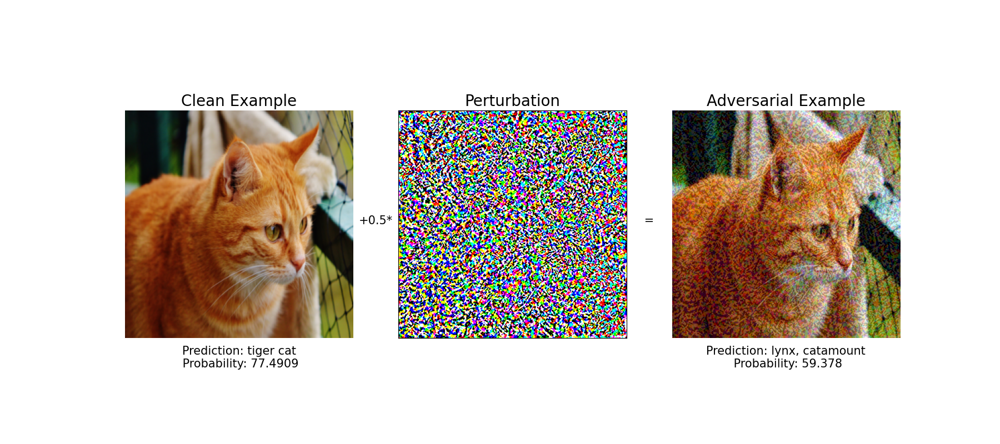

# MAPR2024-EAR-ENAS

## Download Datas

## Attack Example



[robustness-data](https://github.com/nokavietnam/MAPR2024-EAR-ENAS/tree/main/data/robustness-data)


## Install Pytorch

```bash
#Linux and Windows

# cuda
conda install pytorch==1.13.1 torchvision==0.14.1 torchaudio==0.13.1 pytorch-cuda=11.7 -c pytorch -c nvidia

# cpu 
conda install pytorch==1.13.1 torchvision==0.14.1 torchaudio==0.13.1 cpuonly -c pytorch

# OSX
pip install torch==1.13.1 torchvision==0.14.1 torchaudio==0.13.1

```

## Result
